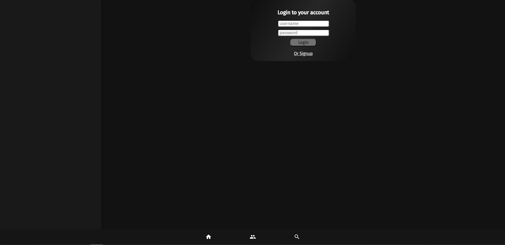

# Messenger React - Working in Progress

Trying out React and Graphql to create a messenger like Discord

## Table of Content

- [Website](#website)
- [User Story & Acceptance Criteria](#user-story)
- [Description](#description)
- [Usage](#usage)

## Website

[TalkTide Website](https://talktide-4335d8586286.herokuapp.com/)

## User Story

\*This user story and Acceptance criteria created by myself to help to keep me on track with my ideas

```md
AS AN user wanting to message my friends
I WANT to be able to add my friends easily
SO THAT I can chat seemsely and quickly
```

## Acceptance Criteria

```md
GIVEN a PHONE LIKE MESSAGING APP
WHEN I load the homepage
THEN I am presented with either a login or a signup
WHEN I click the friend tab
THEN I can view my friends and add new friends
WHEN I click on a friend
THEN I can message them and also recieve messages from them
WHEN I type a message and press enter
THEN the message should appear on the friends side without reloading
```

## Description

This project is using React, for the frontend and GraphQL, Apollo, Websockets, ExpressJS, NodeJS, JSW (Json Web tokens) for the backend. I did this project so that I could learn more about how Websockets worked and how to create instant loading data for an application.

This was interesting to learn about and I want to push it further into a gaming application that people can display that they want people to play with then they can message users on the platform that have set up public groups.

Hopefully, I can keep the passion for this project, but if not I am happy with my progress because I have completed the original task I have set out to create a fully working messaging application.

Ofcourse there are so hickups and a lot of issues with application in it current state and I would definetiley like to make it more refined but as a MVP(Minimum viable product) I am very happy that is is working.

## Usage

How to use the website in its current state?

First create an account or login into a pre existing account.

### Login



### Add a friend

Once login click on the bottom navigation group icon which will take you to the friend tab


Then type in a username and add that friend to your list.


### Start Chatting

Click on that friend and start typing your message


There you are once the message has been sent, the friend will see your message!


